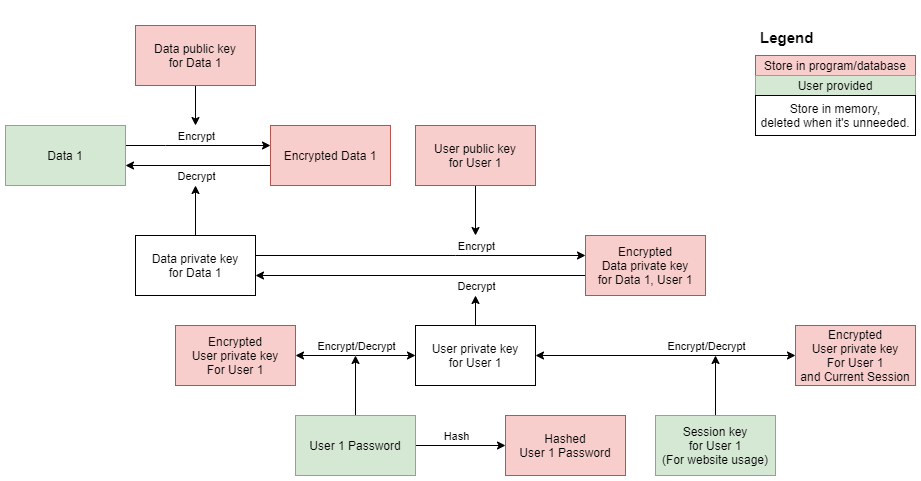

==================================
Proposal for shared-data-encrypter
==================================

Basic information
=================

GitHub repository: https://github.com/Xi-Plus/shared-data-encrypter

An encryption library to encrypt data that you want to send it to multiple people. You don't need to send lots of different copies. And the recipients don't share the key.

Problem to solve
================

If you want to send some secret messages to others, you need to encrypt the messages. If you don't share the encrypt key with the recipient, you need to choose asymmetric cryptography. If you want to send same message to multiple people, you need to encrypt your message by each public key separately, then send different encrypted messages to each people. It need too much storage if data is large or there are too many recipients!

I will propose a simple method and implement it as a library.

I don't propose a new cryptographic algorithm. I use existing algorithm (e.g., RSA) to implement it.

Perspective users
=================

Those who need to share encrypted data with many people, including me. I need to build a site that the data need to be stored with encryption and the function.

System architecture
===================

The data flow is as shown above.

There are Data key and User key. Data key is used for data to encrypt data. User key is used for user to encrypt data key.

Every user will get unique encrypted data key to decrypt data. They need to use their own user private key to decrypt it to get data private key.

There are some requirements, so I designed it like this:

- When writing data, there is no need to decrypt data key, only to check permission.
   - So data key is asymmetric
- When creating new data, it's need to send encrypted data key to all user with viewing permission.
   - So user key is asymmetric.
- Reduce calculation when user changed their password.
   - Decrypt "encrypted user private", then encrypt it with new password. No need to change encrypted data key for the user.
- Reduce calculation when data changed.
   - Encrypt the data with data public key only. No need to change anything else.

API description
===============

- class Data
   - constructor(string text) - Build new data.
   - constructor(integer id) - Load data from database.
   - decryptData(string privateKey) - Decrypt data.
   - giveAccessTo(User user) - Give another user access.
- class User
   - constructor(string id, string password) - Build new user.
   - decryptKey(string password) - Provide password to decrypt the user private key.
   - changePassword(string oldPassword, string newPassword) - Change password of the user.

Engineering infrastructure
==========================

Write comments and follow style guide. Use some tools like autodoc to generate docs automatically.

Write unit tests to check function works.

Schedule
========

Gantt chart:

References
==========

- https://en.wikipedia.org/wiki/Public-key_cryptography
