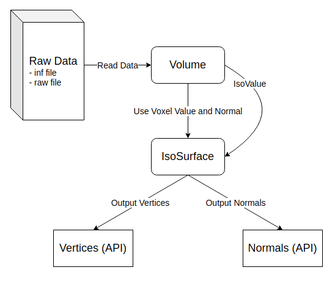

# Proposal for Body IsoSurface

## Basic information

[GitHub](https://github.com/adkevin3307/body_isosurface)

Plot the isosurface with the intensity of body tissue.

## Problem to solve

When humans taking Magnetic Resonance Imaging (MRI) or Computed Tomography (CT), the computer will 
get the intensity of body tissues. We need some algorithms to visualize the intensity data, and 
isosurface is one of them. By plotting the same value of intensity, we can easily recognize specific 
tissue in the body, and also easily find the abnormal place. In summary, I want to develop a method to 
calculate an isosurface with C++, and maybe provide 3D rendering methods for output triangles.

### Algorithm and Mathematics

- Marching Cubes
    - Calculate intersections for each cube (8 voxel per cube)
    - Decide the way that the plane in the cube can be separated to triangles
    - [Marching cubes (wiki)](https://en.wikipedia.org/wiki/Marching_cubes)

### Target

- Well-Defined Structure
- CI Procedure
- Computation Speed
- 3D Rendering (maybe)
    - Camera
    - Shadow
    - Controllable

## Perspective users

All people who is interested in body tissues, special for doctors who need to read MRI and CT results.

## System architecture



The data flow is shown above. Each data has inf file and raw file, inf file records information for data, 
like `endian`, `data type`, `volume size`, and so on, and the intensity values are placed in raw file. 
First, read data with `Volume` class and calculate each voxel's normal. After the `Volume` class calculate 
finish, pass the result to the `IsoSurface` class. The `Volume` class need to decide iso value automatically 
if the user does not define it. When the procedures mentioned above are done, the `IsoSurface` class will 
calculate and separate the isosurface with multiple triangles that follows Marching Cubes method. Then the 
user can get and use triangles and normals for the data.

## API description

- Volume class
```
Volume
    the contructor initialize Volume
    - parameters:
        inf_file (string): inf file path
        raw_file (string): raw file path

~Volume
    destructor

operator()
    getter and setter for voxel value and normal
    - parameters:
        i, j, k (size_t): index for voxel
    - return:
        (float, (float, float, float)): return voxel value and normal

shape
    get volume shape
    - return:
        (size_t, size_t, size_t): return volume shape
```
- IsoSurface class
```
IsoSurface
    the constructor use inf_file and raw_file to initialize Volume
    - parameters:
        inf_file (string): inf file path
        raw_file (string): raw file path
        iso_value (float): iso value (optional)

~IsoSurface
    destructor

iso_value:
    getter and setter for iso_value
    - return:
        (float): iso_value

run:
    calculate iso surface triangles' vertices with Marching Cubes

vertex:
    get triangles' vertices let can be shown on 3D space
    - return:
        (vector<float>): return vertices

normal:
    get vertices' normals which can be used on lighting model
    - return:
        (vector<(float, float, float)>): return normals
```

## Engineering infrastructure

Try to define structure clearly, and use unit test to test each class function correctness. 
Use `clang-format` to make sure coding style the same and easy to read.

## Schedule

- Survey Marching Cubes method (04/11 ~ 04/17)
- Implement `Volume` for reading data (04/14 ~ 04/20)
- Unit test for `Volume` class (04/18 ~ 04/20)
- Implement Marching Cubes in `IsoSurface` class (04/21 ~ 04/27)
- Unit test for `IsoSurface` class (04/25 ~ 04/27)
- Combine each class and test (04/28 ~ 05/04)
- Optimize calculate cost (05/05 ~ 05/11)
- 3D rendering (05/12 ~ )

## References

- https://en.wikipedia.org/wiki/Marching_cubes
