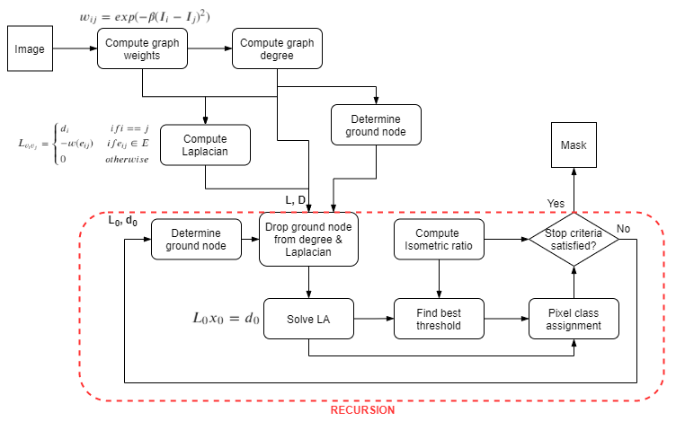

# :pig: PIGS :pig:
Readme for PIGS or Pixelwise Image Graph Segmentation project developmet.

## Basic information
[Official PIGS repo](https://github.com/veax-void/pigs)

Fast package for image segmentatioin using graphs, like your dad use to make! 

## Problem to solve

Pixelwised image segmentation based on graph partitioning  
I propose to use fast lib based on cpp code for image to graph trarnslation and graph segmentation.

**TODO**: add math and algorithm

## Perspective users
All people who use image data representations mostly. But this package for programmers who want to integrate fast graph segmentation in to their projects.

## System architecture

## API
`
PIG(image, beta=95, mode='manual', stop=1e-5, verbose=False)
`  
Initialise PixelwiseImageGraph, and return **graph** object
- **mode**:  
    - manual - user run each step manually  
    - onerun - auto run full pipeline once  
    - usestop - auto run algotirhm using stop condition  
- **stop**: stop parameter for recursion   
- **verbose**: print of progress info  

Now you can access:
- **graph.weights** - graph weights
- **graph.degree** - current graph degree
- **graph.ground_node** - current ground node
- **graph.x** - current solved values 
- **graph.classes** - class of each pixel for current solution

## Infrastructure
Tests list:
- [ ] Memory leakage
- [ ] Isometric ratio function
- [ ] Compute Laplacian function
- [ ] Compute graph degree function
- [ ] Solve LA function
- [ ] Pixel class assignment dunction
- [ ] That recursive not allocate memory each time

## Schedule
Start date: **28.03.2021**  
Deadline: **07.06.2021**  
Last update: **04.10.2021**  
Days to go: **58**  

Plan:
> - **deadline**: taks
>- **04.04.21**: Research
>- **23.05.21**: Development / Testing
>    - **18.04.21**: Finish py prototype
>    - **23.05.21**: Implementation in cpp
>- **30.05.21**: Minor changes, bugfixes
>- **5.06.21**: Final presentation preparation  

Actual progress:
> - **finish_date**: task/comments
> - **8.04.21**:  Research
>- **---**: Development / Testing
>- **---**: Minor changes, bugfixes
>- **---**: Final presentation preparation  

## Papers 
- Isoperimetric Graph Partitioning for Image Segmentation 2006
